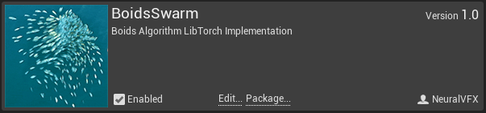
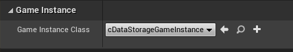
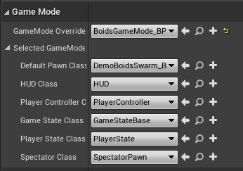
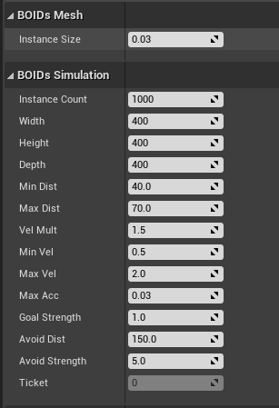

# Getting Started

## Requirements:
- Unreal Engine 4.26
- Visual Studio
- LibTorch 1.7 (GPU)

## Project Setup

#### New Project
- Make a C++ Unreal Project 
- Make sure you have a `Plugins` folder inside of the project

#### Compile
- Clone this Repo into the `Plugins` folder: `git clone https://github.com/NeuralVFX/unreal-boids-swarm-plugin.git` (Or download the zip file and unzip there)
- Right-click your `.uproject` file and click `Generate Visual Studio Project Files`
- Build the project from Visual Studio, using `Build Solution`

#### DLLs
- Follow [directions](https://github.com/NeuralVFX/boids-swarm-dll ) to compile `boids.dll` and place into the bin directory (ie:`Plugins/basic-unreal-libtorch-plugin/Bin/Win64/`)
- Copy `LibTorch DLLs` into the projects (not the plugin) `Binaries` folder (ie:`Binaries/Win64/`)

#### Find Plugin
- Open the compiled project in Unreal Engine
- From `Edit->Plugins`, locate the `Other` Category
- Find `BoidsSwarm` and click `Enable`



#### Scene/World Setup

- To set up keymapping, go to `Edit->Project Settings` and click `Import`, and then import the file `Resources/KeyMapping.ini`
- To enable DLL, open `Settings->Project Settings` and find `GameInstanceClass`, replace this with `cDataStorageGameInstance`


- From the Content Manager, open the level `BoidsSwarm Content Level->FishExample`
- The Boids actor is a Pawn, so in `World Settings`, double check that `GameMode Override` is set to `BoidsGameMode_BP`, this has the Pawn set already.



## Run It

#### Run Test Scene

- Play the level!
- Move the mouse to slide the Boids target around
- Hit space bar to switch between controlling the Attract/Repel targets

# Plugin Contents

## Classes

#### DemoBoidsSwarm - Pawn Class
- Pawn class which contains an `InstancedStaticMesh`, a `Camera`, and two `SceneComponents` to control the Attract/Repel targets.
- On every tick, this queries the next step of the BOIDs simulation and updates the instanced `InstancedStaticMesh`
- The positition/vel is queried from `UDataStorageGameInstance`

#### cDataStoageWrapper - Object Class
- Wrapper for `boids.dll`
- Finds and initiates `DLL`
- Exposes functions of `DLL`

#### UDataStorageGameInstance - GameInstance Class
- This is a wrapper for `cDataStoageWrapper`
- Manages starting and stopping `LibTorch` based on the game state
- Retrieves `LibTorch` output, to pass on to `DemoBoidsSwarm`

## Content

#### BoidsGameModeBP - GameMode BluePrint
- A GameMode which has the `Default Pawn Class` overrriden with `DemoBoidsSwarm_BP`

#### DemoBoidsSwarm_BP - DemoBoidsSwarm BluePrint
- A Blueprint with a fish assigned as the `InstancedStaticMesh` and spheres parented to the Attract/Repel `SceneComponents`

#### FishExample - Level
- A simple level to run `DemoBoidsSwarm_BP` Pawn

## BoidsDemoSwarm Class Attributes



### Boids Mesh
```
--Instance Size, default=.03, type=float                        # Scale of instances
```
### Boids Simulation
```
--Instance Count, default=1000, type=int                        # How many instances to include in simulation
--Width, default=400, type=float                                # Width of starting box for instances
--Height, default=400, type=float                               # Height of starting box for instances
--Depth, default=400, type=float                                # Depth of starting box for instances
--Min Dist, default=25.0, type=float                            # Distance at which neighbor repulsion starts
--Max Dist, default=50.0, type=float                            # Distance at which neighbor attraction ends
--Vel Mult, default=1.5, type=float                             # Overall multiplier for velocity
--Min Vel, default=.5, type=float                               # Minimum velocity clip value
--Max Vel, default=2.0, type=float                              # Maximum velocity clip value
--Max Acc, default=.03, type=float                              # Clip value for overall velocity
--Goal Strength, default=1.0, type=float                        # Multiplier for target attraction velocity
--Avoid Strength, default=5.0, type=float                       # Multiplier for target repulsion velocity
--Avoid Dist, default=150.0, type=float                         # Distance cutoff for goal avoidance
--Ticket, default=0, type=int                                   # Which index is being used to query the DLL
```
